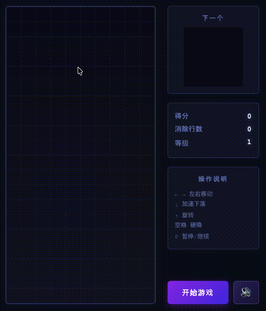
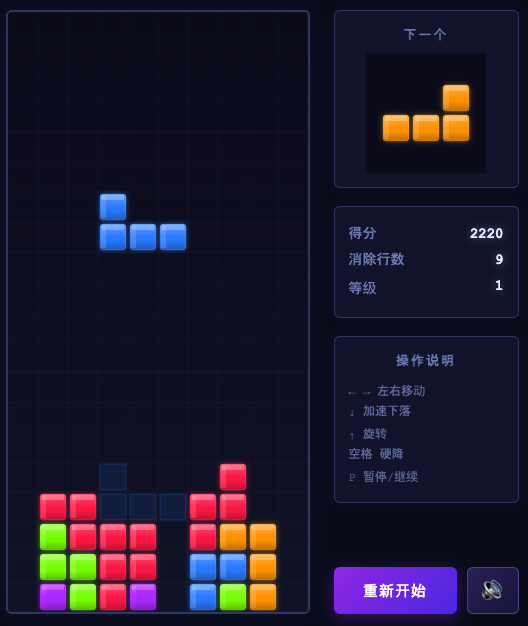

# Tetris

纯原生 JavaScript 俄罗斯方块，HTML5 Canvas 渲染 + Web Audio 程序合成音效，支持 PC 与移动端触屏操作。

## 试玩

👉 **[在线试玩](https://luckyboys.github.io/Tetris/)**

> GitHub Pages 自动部署，打开即玩。

## 试玩视频

## 游戏截图

## 核心玩法

经典俄罗斯方块，填满整行即消除得分。每消 10 行升级，下落速度与 BGM 节奏同步加快。

支持现代计分：软降 +1/格、硬降 +2/格、Combo 连消奖励、Back-to-Back 难消行 ×1.5 倍率、T-Spin 极限操作高分。

全部音效与 BGM 由 Web Audio 程序合成，覆盖移动/旋转/消行/Tetris/升级/Game Over 全事件，BGM 为 A 小调 16 小节循环。

## 操作

| 操作 | 键盘 | 移动端 |
|---|---|---|
| 左右移动 | ← → | ◀ ▶ |
| 软降（加速） | ↓ | ▼ |
| 旋转 | ↑ | ↻ |
| 硬降（直落） | 空格 | ⏬ |
| 暂停/继续 | P | ⏸ |

## 技术栈

- HTML5 Canvas
- CSS3（Flexbox、Media Query、backdrop-filter 模糊玻璃效果）
- Web Audio API（OscillatorNode + GainNode 程序合成音效与 BGM）
- 零依赖，单页应用

---

> **一句话描述**
>
> 依托色彩拓扑的交互矩阵，玩家借由"邻位置换"在步数配额内重组同质单元，触发阈值连通后的结构坍缩与正向反馈，精准收敛于预设关卡目标。
>
> **目标玩家与核心体验**
>
> 该体验致力于为全龄受众构筑低门槛、高纵深的心流场域，以连续消解的神经共振、目标达成的效能确证及前瞻推演衍生的连锁网络，将微观触控升维为逻辑自洽与系统熵减的秩序演算。

🔍 逆向推导：这其实就是俄罗斯方块

| 抽象表述 | 俄罗斯方块对应概念 |
|---|---|
| 色彩拓扑的交互矩阵 | 10×20 棋盘（各色方块组成的网格） |
| 邻位置换 | ← → 移动 + ↑ 旋转（方块在相邻格间变换位置） |
| 步数配额 | 方块自然下落的时间窗口（你必须在落地前完成操作） |
| 重组同质单元 | 将相同颜色的方块拼成完整行 |
| 阈值连通 | 整行被填满（达到 10 格阈值） |
| 结构坍缩 | 消行（填满的行消失） |
| 正向反馈 | 得分、连击特效、屏幕震动、升级音效 |
| 预设关卡目标 | 消除行数 / 生存尽可能久 / 冲击高分 |
| 全龄低门槛 | 上手即玩，规则三句话说完 |
| 高纵深心流场域 | 从基础堆叠到 T-Spin / B2B / Combo 的深度策略空间 |
| 神经共振 | 消行瞬间的音效 + 视觉反馈带来的爽感 |
| 前瞻推演 | 看"下一个"方块提前规划放置位置 |
| 连锁网络 | Combo 连消 + Back-to-Back 滚雪球式得分链 |
| 逻辑自洽与系统熵减 | 把随机掉落的混乱方块整理成有序消除的满足感 |

